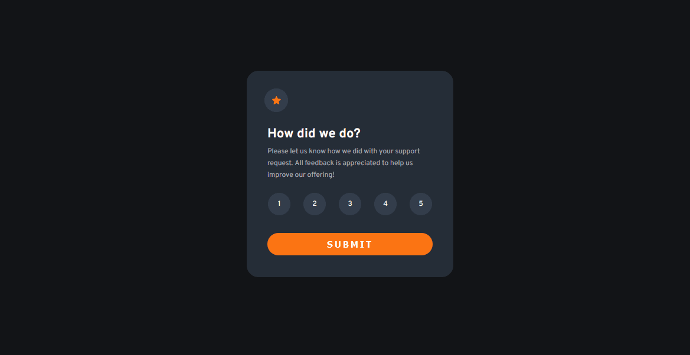

# Frontend Mentor - Interactive rating component solution

Esta é uma solução [Interactive rating component challenge on Frontend Mentor](https://www.frontendmentor.io/challenges/interactive-rating-component-koxpeBUmI).

## Índice

- [Overview](#overview)
  - [O Desafio](#o-desafio)
  - [Screenshot](#screenshot)
  - [Links](#links)
- [Meu processo](#meu-processo)
  - [Tecnologias](#tecnologias)
  - [O Que Aprendi](#o-que-aprendi)
  - [O Que Fazer Agora](#o-que-fazer-agora)
  - [Link Úteis](#links-uteis)
- [Autor](#autor)

## Overview

### O Desafio

Usuários devem ser capazes de:

- Ver o Layout responsivo
- Ver os estados ativos dos botões
- Selecionar e enviar uma nota.
- Ver a página "thank you" depois de ter enviado a nota.

### Screenshot



### Links

- Solution URL:(https://github.com/rialbeg/interactive-rating-component)
- Live Site URL: (https://rialbeg.github.io/interactive-rating-component/)

## Meu processo

### Tecnologias

- HTML5 Semãntico
- CSS
- Flexbox
- Mobile-first workflow

### O que aprendi

Neste projeto consolidei conhecimentos como posicionamento de elementos usando
flexbox, estilização de botões e seus estados e o uso de javascript para gerenciar
o envio de informações como no exemplo abaixo.

```
const selectedText = document.getElementById("selected-text");

const id = localStorage.getItem("id");

selectedText.innerText = `You selected ${id} out of 5`;
```

### O que fazer agora

Agora devo focar em aperfeiçoar os conceitos aqui desenvolvidos e focar em escrever
soluções melhores focando em alguns padrões de projeto.

### Links uteis

- [Exemplo 1](https://developer.mozilla.org/pt-BR/docs/Web/API/Window/localStorage) - Me ajudou com a api da localStorage para lidar com informações entre páginas
- [Example resource 2](https://www.geeksforgeeks.org/how-to-add-a-pressed-effect-on-button-click-in-css/) - Me ajudou nos efeitos quando se clica em um botão.

## Autor

- Portfolio - [Gabriel Mascarenhas]()
- Frontend Mentor - [@rialbeg](https://www.frontendmentor.io/profile/rialbeg)
- Linkedin - [@gsamascarenhas](https://www.linkedin.com/in/gsamascarenhas/)
